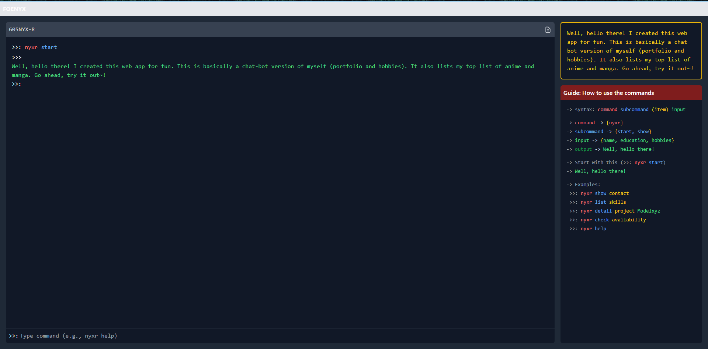

# NYX Terminal



A sleek, interactive terminal-style interface built with React and Tailwind CSS that simulates a command-line portfolio. NYX Terminal offers an engaging way to showcase personal information, projects, and interests through a developer-friendly interface.

## 🛠️ Technologies Used

- **React** - UI components and state management  
- **Tailwind CSS** - Styling and layout  
- **ES6+** - Modern JavaScript features  
- **React Hooks** - State and side effects management 

## Features

- 🖥️ Terminal-like user interface with command prompt
- 🎨 Color-coded command syntax for easy readability
- 💾 Multiple data categories (projects, skills, anime, manga, games)
- 📝 Detailed command documentation and help system
- ⌨️ Command history and scrollable output
- 🧩 Modular component architecture
- 🔄 Easily extensible for custom data and commands

## Live Demo

Check out the [live demo](https://your-demo-url.com) to try it yourself!

## Commands

NYX Terminal uses a structured command syntax: `nyxr [subcommand] [item] [input]`

### Available Commands

```bash
nyxr start                     # Show welcome message
nyxr help                      # Display available commands
nyxr show contact              # Display contact information
nyxr show anime                # List all anime with details
nyxr show manga                # List all manga with details
nyxr list skills               # List all technical skills
nyxr list hobbies              # List all hobbies
nyxr detail project Modelxyz   # Show details of specific project
nyxr detail anime "Death Note" # Show details of specific anime
nyxr check availability        # Check availability status
```